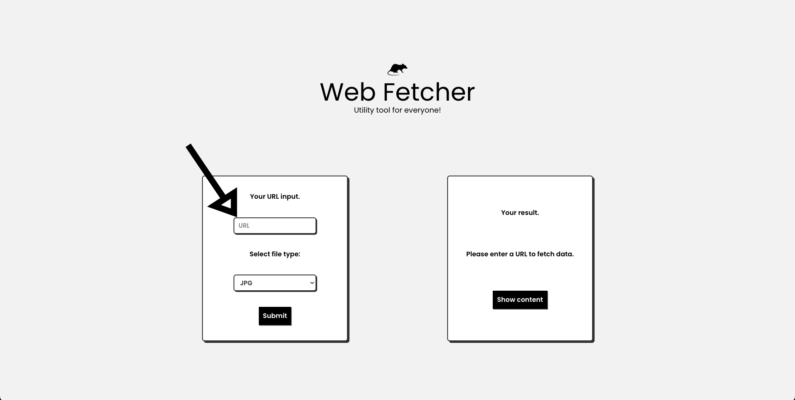

# Web Fetcher Tool 

## 📋 Table of contents

        

		Click Me
        

        <ul style="list-style-type: none;">
	        <li>📝 <a href="#description">Description</a></li>
            <li>🔧 <a href="#tech-stack">Tech stack</a></li>
            <li>💻 <a href="#utilisation">Utilisation</a></li>
            <li>⏳ <a href="#whats-next">What's next ?</a></li>
            <li>👷 <a href="#authors">Authors</a></li>
        </ul>

## 📠Description

### Project Overview:

The Web Fetcher Tool was born out of frustration with the tedious process of searching for and downloading photos from various websites. Tired of navigating multiple sites and downloading images individually, I set out to create a simple, accessible tool for everyone.

### Objective and Scope:

The main goal of the project is to streamline the process of fetching and downloading images from URLs entered by users. By eliminating the need to manually search and download photos from different websites, the tool aims to save time and effort for users seeking to collect images efficiently.

### Non-Profit and Learning Emphasis:

The project emphasizes non-profit motives and serves as a learning experience in web development. It aims to contribute positively to the community by providing a free and useful tool while advancing my skills in programming and web technologies.

## 🔧 Tech stack

    
    
    
    
    
    
    
    
    
    

## 💻 Utilisation

When you open the website, you can enter any URL you want and click on the "Submit" button to obtain a result in the right window called "Your result." Click on the "Show content" button to display all fetched images.

This is the result. you can download each picture one by one or all of them in a zip file.

## ⏳ What's next ?

- For the moment, I want to improve the number of websites I can fetch with my tool, but I encounter some issues because of the robots.txt file.

## 👷 Authors

**VERNHET Noah**

- Github: [@truuue](https://github.com/truuue)
- LinkedIn: [Noah Vernhet](https://www.linkedin.com/in/noah-vernhet/)
